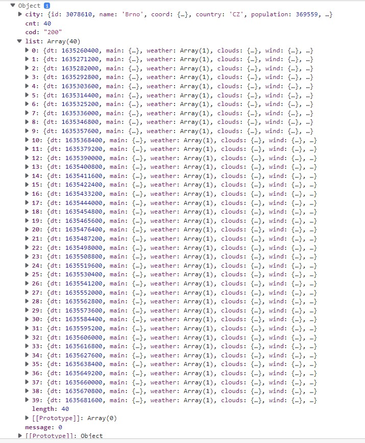

# Aplikace na zobrazení počasí 

V tomto úkolu si vytvoříme aplikaci, která nám zobrazí aktuální počasí a předpověď na pět dní ve vybraném místě. Finální aplikace bude vypadat takto:  
     


## API

K získání dat o počasí budeme používat API zdarma z [open weather map](https://openweathermap.org/api).
K použití daného API je potřeba se zaregistrovat, a získat tak unikátní ID, které budeš zadávát v URL API. Zaregistruj se tedy na stránce a počkej, až ti přijde e-mail s potvrzením. V emailu uvidíš své API ID a také URL endpoint, který je potřeba použít při získávání dat. API ID si můžeš také zjistit ve svém profilu na stránce OpenWeather, kde si můžeš zakládat i další ID. Měj na paměti, že aktivace klíče po registraci může trvat několik hodin. Mezitím velice doporučuji podívat se na [dokumentaci OpenWeather](https://openweathermap.org/current) a pročíst si v jakém formátu ti data přijdou. 
     


## Spuštění a struktura aplikace

Vycházej z kódu v tomto repozitáři. Vše nainstaluješ pomocí spuštění příkazu 
#### `npm install`    
Po nainstalování spusť aplikaci pomocí 
#### `npm start`
Měla bys vidět toto:     


Hlavní html a css je pro tebe už připravené. Prohlédni si obsah složky `src`.     
V souboru `index.js` probíhá renderování aplikace, není sem potřeba nic přidávat, ani upravovat. V `index.css` je globální stylování, všimni si, že pro základní barvy a styly jsou vytvořené proměnné, které se pak používají skrz celou aplikaci. Kdybychom třeba chtěli změnit barevnou paletu, stačí upravit barvy tady a není potřeba procházet css celé aplikace.      
V souboru `App.js` je připravený základní obsah aplikace. Nějaký obsah je zakomentovaný, aby se nám aplikace zkompilovala. V `App.css` je pak připravené stylování. 

## Data 

Abychom mohli v aplikaci zobrazovat informace o počasí, potřebujeme nejdřív data stáhnout.   
Jelikož data z OpenWeather jsou v angličtině, a dotazy je potřeba také dělat v angličtině, naše aplikace je také v AJ, aby to nebyl takový mišmaš. 
V `App.js` si napiš fetch funkci, ve které použiješ URL a API ID z emailu, který ti došel. Vyber si nějaké město, jehož data budeš na začátek stahovat, než přidáme možnost město měnit.     
Je možné, že základní teplota, kterou open weather posílá bude v kelvinech, v takovém případě přidej do URL parameter `units=metric`. 
Tvoje API URL by mohlo vypadat nějak takhle:       
`api.openweathermap.org/data/2.5/weather?q=Prague&units=metric&appid={tve unikatni API ID}`     
Funkci potom zavoláš v useEffectu, při prvním vyrenderování komponenty App. `App.js` bude vypadat nějak takto: 

```jsx
import React, { useEffect } from "react";
import "./App.css";

const App = () => {
  const fetchWeather = () => {
    fetch(
       // TVUJ KOD
    )
  }
  
  useEffect(() => {
    fetchWeather();
  }, []);
  
  return (
    <div className="App">...</div>
    )
  }
```
Získaná data si vypiš do konzole. 
Na zdroje pro tvoření funkce, kde se fetchují data z API se můžeš podívat [tady](https://www.pluralsight.com/guides/fetching-data-updating-state-hooks) a [tady](https://blog.bitsrc.io/fetching-data-in-react-using-hooks-c6fdd71cb24a)

### Nastavení .env 
Pokud si aplikaci v tomto stavu commitneš na github, přijde ti za chvíli e-mail o tom, že je nebezpečné ukládat API ID do github repozitáře, kde je může kdokoli vidět a zneužít. Proto budeme muset zajistit, abys měla ID uložené pouze u sebe. Toto se dělá za použití tzv. [Environment variables](https://create-react-app.dev/docs/adding-custom-environment-variables/).    
1. V základní složce souboru (**ne v src, o jednu složku výš!**) si vytvoř soubor s názvem `.env`
1. V tomto souboru si své ID ulož jako `REACT_APP_MY_API_ID="xxxxxxxxxxx"`, kde xxx je tvé ID. Můžeš si ho pojmenovat jak chceš, ale je vždy potřeba začít REACT_APP. 
1. Dále si tento soubor .env přidej do .gitignore, aby se soubor nenahrál na github.
```js
#api keys
.env
```
4. Kde budeš ID potřebovat, stačí si ho získat pomocí `process.env.REACT_APP_MY_API_ID` a uložit si ho do proměnné, kterou potom použiješ v API URL. 
5. Po nastavení .env si nezapomeň aplikaci restartovat, aby se změny projevily. 

## State management 

V každé aplikaci je potřeba někde schraňovat data, která se na frontendu zobrazují. Pokud je aplikace větší, používají se na toto složitější nástroje, jako [Redux](https://redux.js.org/introduction/core-concepts), nebo [Recoil](https://recoiljs.org/docs/introduction/core-concepts). Další možností je použití [React Context](https://reactjs.org/docs/context.html). Více informací o možnostech state managementu najdeš [v článku.](https://dev.to/workshub/state-management-battle-in-react-2021-hooks-redux-and-recoil-2am0)      
Jelikož je naše aplikace malá, postačí použití lokálního stavu, tedy použití hooku [useState](https://reactjs.org/docs/hooks-state.html). 
V `App.js` si vytvoř stav, do kterého budeš ukládat data získáná z API. Vhodně si ho nazvi, třeba `weather` a funkci na změnu stavu `setWeather`. Jako defaultní hodnotu použij `null`.
Místo vypisování do konzole teď budeš nastavovat získaná data do stavu za použití funkce `setWeather`. 

## Zobrazení dat 
Při správném postupu kroků bys měla teď mít ve stavu uložený objekt, který má takový formát:     

 

Na obrázku jsou vyznačené hodnoty, které budeš zobrazovat v elementech uvnitř `div.weather__current`. Jak vidíš, některé hodnoty je potřeba před použitím trochu upravit.     

#### Teplota 
Teplotu získáš s přesností na desetiny stupně. Zaokrouhli ji na celá čísla, můžeš k tomu použít třeba [Math.round](https://developer.mozilla.org/en-US/docs/Web/JavaScript/Reference/Global_Objects/Math/round).  

#### Ikona 
V klíči icon, vidíš pouze kód ikony (např. `"01d"`), který je potřeba použít v URL z [dokumentace openWeather](https://openweathermap.org/weather-conditions). Toto url potom použij v src ikony stylem     
```js

```
#### Čas východu a západu slunce
Východ a západ slunce je takové zvláštní dlouhé číslo. Je to [Unix Time Stamp](https://www.unixtimestamp.com/), tedy čas ve vteřinách, který uběhl od 1.1.1970. Budeš si muset vytvořit vlastní funkci, která si jako parametr vezme toto číslo a vrátí nám string v potřebném formátu, tedy např `"17:05"` nebo `"8:10"`.           
1. K převedení na hodiny a minuty budeš potřebovat použít javascriptový object [Date](https://developer.mozilla.org/en-US/docs/Web/JavaScript/Reference/Global_Objects/Date). Podrobnější návod na převod unix časové značky na čas je třeba v [tomto článku](https://coderrocketfuel.com/article/convert-a-unix-timestamp-to-a-date-in-vanilla-javascript). 
1. Pro zobrazení minut ve dvouciferném formátu můžeš použít funkci [padStart](https://developer.mozilla.org/en-US/docs/Web/JavaScript/Reference/Global_Objects/String/padStart) - pozor, funguje jen na řetězcích!        
Kdyby sis s funkcí vůbec nevěděla rady, tak v dropdownu je jedno z možných řešení. Ale zkus to nejdřív sama! ;) 
          <details>
          <summary>Už jsem to zkusila, chci se podívat.</summary>
          <br>
Jsi si určitě jistá, nechceš se na to ještě podívat? A co se inspirovat nějakým [řešením tady](https://stackoverflow.com/questions/847185/convert-a-unix-timestamp-to-time-in-javascript)? 
          <details>
          <summary>Ani tohle nepomohlo.</summary>
          <br>
          Super, že jsi to alespoň zkusila :) Pamatuj, že toto je pouze jedno v mnoha možných řešení ;) 
               <pre><code>
                    const getTimefromUnix = (unix) => {
                         const hours = new Date(unix * 1000).getHours();
                         const minutes = new Date(unix * 1000).getMinutes();
                         const twoDigitMinutes = minutes.toString().padStart(2, "0");
                           return `${hours}:${twoDigitMinutes}`;
                        };
               </code></pre>
          </details>
      </details>
      
### Podmíněné zobrazování 
Pokud se ti správně podařilo hodnoty upravit, nic nebrání tomu je zobrazit v naší aplikaci, že?     
Ale co to? Při spuštění nastane error, který nám říká, že nelze číst hodnoty z našeho stavu!     
Důvod je ten, že se data chtějí vykreslovat při spuštění aplikace, kdy je stav nastaven na `null`. Teprve až po získání dat z API, které chvilku trvá, se stav nastaví na potřebný objekt.     
Chceme tedy zobrazit obsah divu s třídou `weather__current` pouze v případě, že data máme. K tomu můžeme použít ternární operátor. 
Bude v tomto formátu: Pokud stav není `null` nebo `undefined`, zobraz `div.weather__current` a jeho obsah, v opačném případě nezobrazuj nic (`null`).

#### Komponenta
Pro lepší přehlednost přesuň celý `div.weather__current` a jeho obsah do samostatné komponenty (programujeme přece v Reactu ;)). Komponenta bude brát jednu prop, a to objekt s počasím, který pak použiješ na zobrazení dat. Nezapomeň na přesunutí stylů a funkcí, která upravují data.     
Komponentu si naimportuj do `App.js`, použij na správném místě a pošli stav `weather` jako prop.  
Pokud chceš, můžeš si vytvořit i komponentu s obsahem `"Loading..."`, nebo se spinnerem, která se zobrazí před načtením dat.   

#### Změna barvy pozadí 
U divu s třídou `weather__current` přidej podmíněně `třídu weather__current--cold`, pouze pokud je teplota nižší než 10 stupňů. 

## Přidání dalších měst 
Skvělá práce! Podařilo se nám stáhnout informace o počasí v určitém městě a zobrazit je v naší aplikaci nastylované a v určitém formátu!    
Chtělo by to ale přidat více možnosti, že? V tomto kroku si do aplikace přidáme další stav pro změnu města a tlačítka na zobrazení počasí na třech různých místech. 

#### Nový stav 
Vytvoř si nový stav s vhodným názvem (např. `city`) a ulož do něj jako řetězec název svého města, pro které sis teď stahovala data. Tímto stavem potom nahraď ve fetchi v URL město, které máš teď "natvrdo" napsáno     
(např. api.openweathermap.org/data/2.5/weather?q=**Prague**&appid={tve unikatni API ID}).        
Stav `city` si budeš muset poslat jako parametr do funkce, kde probíhá fetch, abys ho mohla v URL použít. 

#### Změna stavu
Stav `city` budeme měnit kliknutím na tlačítka, která pro tento účel máš v HTML připravená a zakomentovaná. Odkomentuj si `div.button-group` s třemi tlačítky.     
Vyber si tři města (anglické názvy, např "Prague", "Reykjavik", "Tenerife"), která napíšeš na tlačítka. Při kliku na tlačítko změň stav na toto město.          
Funkci, která se zavolá na klik si můžeš vytvořit zvlášť a pojmenovat ji `handleButtonClick`. Funkce bude brát jeden parametr, a ten potom nastaví do stavu `city`.
Pozor, abys na onClick funkci pouze předávala a nevolala ji! Předávat funkci s parametrem můžeš pomocí anonymní fuknce:     
`<button onClick={() => handleButtonClick(someValue)}> ... </button>`

             
Teď by se zdálo, že pokud změníme stav, změní se i data, která pomocí stavu získáváme. Zatím se to ale neděje.    
Je to proto, že fetch voláme pouze při spuštění aplikace. Aby se data načetla pokaždé, když změníme stav `city`, musíme `city` poslat jako [závislost](https://www.benmvp.com/blog/object-array-dependencies-react-useEffect-hook/) do useEffectu. 

## Předpověď na pět dní 
Už dokážeme získat aktuální počasí na různých místech, teď ještě zobrazíme předpověď na následujících 5 dní.      
Vytvoř si další funkci, kde budeš fetchovat data z OpenWeather. [V dokumentaci najdeš potřebné URL](https://openweathermap.org/forecast5).     
Jako město opět použij `city`, které máš uložené ve stavu. Předej ho do funkce jako parametr.     
Nejdříve si data vypiš do konzole. 
Předpověď na 5 dní je uváděná po 3 hodinách. Každý den 8 předpovědí, 5 x 8 = 40! V datech získáme tedy pole o 40 položkách s údaji o počasí. 



Nám ale stačí pouze jedna předpověď na den, tedy každá osmá. Vytvoř si funkci, která jako parametr bere pole a vrátí nové pole, které bude obsahovat pouze každou 8. položku. Hodit se ti možná bude funkce [filter](https://flexiple.com/javascript-filter-array/). Ale jde to i bez ní :) 
 <details>
          <summary>Zkouším horem dolem a nejde to, chci nápovědu.</summary>
          <br>
               Můžeš filtrovat ne jen podle samotných položek, ale také podle indexu, na kterém se položka nachází.      
     <br/>
     <code>array.filter((item, index) => ... ); </code>   
     <br/>
               item se někdy nahrazuje pouze podtržítkem, pokud se nepoužívá.
          <details>
          <summary>Stále netuším :(</summary>
          <br>
          Tak je fajn, že jsi to alespoň zkusila a něco nového se naučila! Pamatuj, že toto je pouze jedno v mnoha možných řešení ;) 
               <pre><code>
     const filterForecast = (array) => {
          return array.filter((_, index) => index % 8 === 0);
     };
               </code></pre>
          </details>
      </details>

#### Nastavení stavu forecast 
Vytvoříme si ještě jeden stav, který bude v sobě mít pole s předpovědí na 5 dní. Tento stav si nazvi `forecast` a funkci na změnu `setForecast`. Nastav defaultní hodnotu na `null`.
Při fetchování dat o předpovědi místo výpisu do konzole nastav stav `forecast`. Není třeba si ukládat celý objekt s polem o 40 položkách, proto při volání `setForecast` použij svou filtrovací fuknci a tak nastavíš do stavu pouze data, která budeme používat. 

#### Příprava dat
Po provedení fetche budeš mít v proměnné `forecast` pole s položkami takového formátu: 


Opět vidíš vyznačená data, která budeme potřebovat k zobrazení předpovědi počasí. Teplotu už umíš zaokrouhlit a ikonu si už umíš použít, aby se zobrazily tak, jak potřebujeme.     
Ale ajaj, pod klíčem `dt` je opět ten divný kód. Teď z něj nepotřebujeme hodiny a minuty, ale den v týdnu, datum a měsíc.    
Vytvoř si funkci, která bude jako parametr brát unix time stamp a vrátí ti řetězec ve formátu `"Tuesday, 25 October"`. Budeš muset opět použít `new Date ...`, a nějakou z metod jako `getDay()`, `getDate()` a `getMonth()`. 

<details>
          <summary>Už jsem nějakou funkci napsala, ale zasekla jsem se.</summary>
          <br>
Jedno řešení je za použití pole dnů v týdnu a měsíců v roce. Můžeš si zkopírovat tato: 
<pre><code> 
const days = [
  "Monday",
  "Tuesday",
  "Wednesday",
  "Thursday",
  "Friday",
  "Saturday",
  "Sunday",
];     
const months = [
  "Jan",
  "Feb",
  "Mar",
  "Apr",
  "May",
  "Jun",
  "Jul",
  "Aug",
  "Sep",
  "Oct",
  "Nov",
  "Dec",
];        
</code></pre>  
          <details>
          <summary>Aha! Zkouším to dál, i s googlem a polema a jsem v koncích, Pomooooc..</summary>
          <br>
          Opět tady uvidíš jen jedno z možných řešení, zkus si navrhnout i nějaké svoje :) 
               <pre><code>
 const getDayfromUnix = (unix) => {
  const date = new Date(unix * 1000);
  return `${days[date.getDay()]}, ${months[date.getMonth()]} ${date.getDate()} `;
};
               </code></pre>
          </details>
      </details>
 
#### Zobrazení předpovědi
Data máme nachystaná, teď už je jen zobrazit! Jak už asi správně tušíš, budeme opět mapovat, protože ve stavu máme pole :) 
`div.weather__forecast` obsahuje zatím jen jeden `div.forecast`. Pomocí mapování vykresli 5 takových divů se správným obsahem na následujících pět dní.     
Budeš tedy mapovat stav `forecast`, do kterého sis uložila vyfiltrované pole o 5 položkách.     
Nezapomeň, že stejně jako u divu `weather__current` jsme museli obsah zobrazit podmíněně, musíme i tady použít ternární operátor. 
Pokud `forecast` není `undefined` nebo `null`, zobraz předpověď. V opačném případě nezobrazuj nic, a nebo komponentu Loading, kterou sis vytvořila. 
#### Komponenta
Pro lepší přehlednost přesuň předpověď do samostatné komponenty.Podobně jako u aktuálního počasí je potřeba si posílat v prop data, který budeš v `div.forecast` vykreslovat. Nezapomeň na přesunutí souvisejících stylů. 

## Úklid kódu 
Asi se ti ted v App.js a na různých místech nahromadily všemožné funkce a pomocná pole. Trochu si kód uklidíme. V `src` si vytvoř složku `utils`. V ní si vytvoř javascriptový soubor, do kterého přesuneš všechny pomocné fuknce - převod unixtimestamp na čas a na datum, filtrování pole, případně pomocná pole s dny v týdnu a měsíci. Tyto funkce si exportuj a pouze je importuj na místech, kde je využíváš.     

## Hostování stránky
Nasaď si stránku za použití třeba služby [netlify](https://www.netlify.com/). Budeš se muset přihlásit svým github účtem a z něj potom vybrat správný repozitář. 
Na netlify si můžeš přečíst [návod](https://www.netlify.com/blog/2016/09/29/a-step-by-step-guide-deploying-on-netlify/), který tě provede jak stránku nasadit a které příkazy použít. Nebo si vybrat jakoukoli jinou hostovací službu, kterou znáš.       
Při nastavení deploye na Netlify budeš muset nastavit i proměnné, které máš momentálně schované v souboru `.env`, který je jen u tebe na počítači. Při nastavení deploye, klikni na 
#### Show advanced
uvidíš sekci 
#### Advanced build settings    
Tam si přidej klíč pomocí kliknutí na **New variable**. Klíč musí být se stejným názvem, jako je v souboru .env.        


Při odevzdání úkolu v Czechitas portálu dej odkaz na github, ale i na stránku, kterou hostuješ.

## Bonus
Už to vypadá dobře! Velice solidní appka! 
Pojďme to vzít ještě dál, proč jen tři města? Mám pro tebe připravené pole 50 světových měst, která budeme moct v aplikaci zobrazovat. 
```js
const cities = [
  "Abuja",
  "Amsterdam",
  "Aswān",
  "Athens",
  "Bangkok",
  "Barcelona",
  "Belgrade",
  "Brno",
  "Budapest",
  "Buenos Aires",
  "Cape Town",
  "Dakar",
  "El Alto",
  "Hanoi",
  "Harbin",
  "Kingston",
  "Kuala Lumpur",
  "Kuwait",
  "Kyiv",
  "Lagos",
  "Ljubljana",
  "London",
  "Madrid",
  "Melbourne",
  "Miami",
  "Minsk",
  "Moscow",
  "New Delhi",
  "New York",
  "Norilsk",
  "Paris",
  "Porto",
  "Prague",
  "Reykjavik",
  "Seoul",
  "Skopje",
  "Sofia",
  "Split",
  "Sydney",
  "São Paulo",
  "Tallinn",
  "Tenerife",
  "Tirana",
  "Toronto",
  "Vancouver",
  "Vienna",
  "Vilnius",
  "Warsaw",
  "Winnipeg",
  "Yakutsk",
];     
```
Toto pole si překopíruj do aplikace na vhodné místo, například do samostatného souboru ve složce `utils`. Proměnou nezapomeň exportovat.    
Mohli bychom místa zobrazit pomocí tlačítek, ale to by přece jen bylo trochu nepřehledné. Lepším řešením bude formulářový prvek `<select>`.
Níže vidíš přípravený HTML kód, který si můžeš překopírovat do aplikace. 
```html
<div className="select-wrapper">
  <select
    className="select"
    name="cityselect"
    id="cityselect"
    value={"--"}
    onChange={console.log("select changed")}
  >
    <option value={"--"}>city</option>
  </select>
</div>

```

Momentálně máš v selectu jen jednu option. Namapuj všech 50 měst z daného pole jako prvek `<option>`. Zařiď, aby se na změnu hodnoty v selectu změnil i stav `city`. Musíš si vytvořit funkci, kterou zavoláš na `onChange`. Tím budeme měnit i aktuální počasí a předpověď.    


    